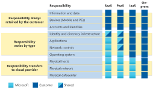

# Microsoft Certified: Azure Fundamentals (AZ-900)

## Microsoft Azure Fundamentals: Describe cloud concepts 

1. Introduction [here](https://learn.microsoft.com/en-gb/training/paths/microsoft-azure-fundamentals-describe-cloud-concepts/)

### Introduction
What is Cloud Computing? Cloud computing is where by you do not own/host/buy your own hardware but instead you loan out computing such as compute or storage to a third party cloud hosting platform provider. 
These providers manage the upkeep and costs of the hardware for you so you don't have to.
Because the hardware is part of the third party data centers, they allow you scale vertically as well as horizontally extremely easily by simply requesting more computing services at the touch of a button.

The following are some benefits of using cloud:
- **Availability** (uptime) is a term used to describe how available your service is, how little downtime there is for a service. Azure and its services guarantee uptime by giving a service-level agreement (SLA). Each service may have its own SLA. Getting 100% uptime is close to impossible so SLA's of 99% or 99.9% are given instead. There are hours of difference between 99% availability (432 min/month downtime) vs 99.9% availability (43.2 min/month).
- **Scalability** is the ability to adjust your resources to meet your demands, whether they be growing (and so scale up) or shrinking (scale down). If you know or are hitting peak traffic and your resources are getting clogged up, you can request additional resources on demand.
  - Vertical scaling is increasing or deceasing the capabilities of the resource you are currently utilizing, possibly by adding more cpu power or storage space to your VM. It's about making your existing computer more powerful.
  - Horizontal scaling is the adding or subtracting of resources in your estate, you can immediately deploy out an additional compute server or storage db for handing a peak load. 
- **Reliability** is whether the services/resources you are wanting to utilize will work for the function they are offering, specifically after a failure, i.e. after a failure is the resource able to work reliably, is it able to come back online and run as before. Thanks to the decentralized nature of the cloud it is naturally reliable and resilient infrastructure. You can deploy your application to different regions around the world for your own reliability, Azure can automatically shift resources to another datacenter or region if there are failures.
  - **Its one of the pillars of the MS Azure Well-Architected Framework**
- **Predictability**, Azure allows you to predict not only costs but the performance of your resources to ensure you are utilizing the most out of them and not overpaying for what you don't need.
  - Performance predictability is where you can use features like Autoscaling and load balancing to improve performance.
  - Cost predictability is where you can forecast your cloud spend by tracking/monitoring your resources in real time.
- **Security**, IaaS cloud offers security of getting access to physical machines and you to control what OS and software get installed. PaaS and SaaS are different whereby the cloud provider handles patching and updating for you. Once again thanks to the decentralized nature of cloud, DDoS attacks are more limited. 
- **Governance**, Azure offers you to create set templates of resources to ensure you're meeting corporate or government standards and allows updating of existing resources to these new templates easily. You can easily audit to identify which resources are out-of compliance and action with automatic patches and updates if possible. 
- **Manageability**
  - Manageability Of the cloud, is about managing your resources in the cloud by automatically scaling/deploying when needed, configuring resources, monitoring their health, receiving alerts based on any metrics given.
  - Manageability In the cloud, is about how you manage your cloud environment and resources, such as through the Azure web portal, through a CLI, through other applications via a API

#### Shared Responsibility Model
Is where the cost of maintaining, upgrading, security, replacing of the hardware is shared between the consumer (you) and the cloud provider (Azure) 
- The cloud provider is responsible for physical security, powering and cooling of the hardware, network connectivity and minimum security in the data center itself and maintenance and upgrading of hardware.
- The consumer is responsible for the data within (your) services in the cloud, the security between (your) services and access from outside world .
- Responsibility is shared between the two for cases such as
  - Specific services
    - Using Cloud SQL, the provider is responsible for upkeep/security/versioning of the SQL server, the consumer is responsible for the data in the database.
    - Compared to just renting a Compute server and installing your own version of Oracle SQL on there, instead you are responsible for the upkeep/security/versioning of the SQL database on the server AND the data, but now the provider is only responsible for the upkeep/security of the server.

##### Infrastructure as a Service (IaaS)
Most flexible by given you the most control over your resources meaning most of the responsibility is on the consumer.
The cloud provider is responsible for maintaining the hardware, internet network connectivity and physical security.
The consumer is responsible for the OS, configuration, software+config, network config, maintenance, database+config, etc... 
Essentially you as a consumer are just renting hardware someone else's Infrastructure.

##### Platform as a Service (PaaS)
Is a middle ground between IaaS and SaaS.
The cloud provider is responsible for all the things an IaaS provider does but also maintain the OS, any middleware, development tools if necessary and licencing & patching for any OS/Software/Database tools they offer.
The consumer is responsible for their application, software, data, running on their platform.

##### Software as a Service (SaaS)
Most responsibility is on the cloud provider, whereby the provider has full responsibility of the entire infrastructure and platform (physical security, power, network connectivity, service uptime, security, versioning, etc...).
Basically everything a IaaS and a PaaS provider will do but also updates the software application it is providing.
You as a consumer just get access to a specific software service which you either pay as you go for or have a membership for.

##### Scenarios
- IaaS
  - Lift and shift migration. You're setup on-prem, you just want to move yourself to the cloud, IaaS is most similar to your on-prem data center setup.
  - Testing & Development. You can rapidly replicate start-up/shutdown environments in the cloud on IaaS and you are in complete control
- PaaS
  - Development framework, PaaS providers a quick environment for devs to build, test and deploy their own custom based applications without worrying about hardware. Features for scaling and load balancing should also be available to them. 
  - PaaS providers usually come with analytics or business intelligence tools allowing for quickly capturing and mining their customer data easily
- SaaS
  - Cloud based storage
  - Emailing and messaging

Examples of providers
- IaaS
  - Azure
  - AWS
- PaaS
  - Heroku
- SaaS
  - Salesforce

### Cloud Models

#### Private Cloud
Is an offering by cloud providers to corporations in which corporations get their own private slice of cloud. A single entity will use a private cloud so that they can have greater control over what they will allow their own internal company use within the cloud platform such as services, outside network access, subscriptions, etc... and are able to handle costs at a wider corporate level much easier.
A private cloud can even be deployed onto a corporations own data center.
- Organizations have complete control over resources and security
- Data is not collocated with other organizations’ data
- Hardware must be purchased for startup and maintenance
- Organizations are responsible for hardware maintenance and updates

#### Public Cloud
Is the cloud platform built and controlled by the cloud provider (Azure) in which anyone can access, register, subscribe, pay, etc...
- No capital expenditures to scale up
- Applications can be quickly provisioned and deprovisioned
- Organizations pay only for what they use
- Organizations don’t have complete control over resources and security

#### Hybrid Cloud
Is an environment that uses both public and private cloud options in an interconnected environment.
One example of using a Hybrid cloud is if during running of applications in a private cloud a sudden spike in resources is required and your cloud is interconnected to a public cloud, you can temporarily deploy and make use of the public cloud resources.
A Hybrid cloud user can select what services they want in either the public and private cloud and can choose to reploy into either one depending on their use case.
- Provides the most flexibility
- Organizations determine where to run their applications
- Organizations control security, compliance, or legal requirements

#### Multi Cloud
Is where you use multiple cloud providers to meet your demands either in parallel or temporary for the purpose of migrating from one provider to another.

### Consumption based model
- Capital Expenditure (CapEx)
  - Is typically a one-time upfront cost to purchase some resource such as a building, datacenter, computer, etc...
- Operational Expenditure (OpEx)
  - Is spending money on services or products overtime, renting or leasing something, or purchasing a monthly/yearly membership.

Cloud computing is a form of Operational Expenditure. You're not making a one time payment for something but rather leasing/subscribing to something overtime.

The benefits of this kind of model:
- No upfront costs - so you can quickly and cheaply get started.
- No need to pay/manage infrastructure - so you can direct your costs directly to what it is you need immediately.
- You can pay for more resources when they're needed.
- You can stop paying for resources when they are no longer needed.

Cloud computing is essentially a pay-as-you-go computing service, you rent compute power and storage from someone else’s datacenter and when you're done you can just stop paying, close everything down and don't need to worry about datacenter costs or management.
- Plan and manage your operating costs.
- Run your infrastructure more efficiently.
- Scale as your business needs change.

### Microsoft Azure Well-Architected Framework Pillars
- Reliability: Ensures a system/resource can recover from a failure and continue to function as normal once recovered.
- Security
- Cost Optimization
- Operation Excellence
- Performance Efficiency

### End
Now you should be able to answer the following questions:

1. What is Cloud Computing
2. What is a shared responsibility model
3. What are each of these Cloud models
   1. Public 
   2. Private 
   3. Hybrid
4. What are some appropriate use-cases for each cloud model
5. What is a consumption-based model
6. Compare cloud pricing models
7. In terms of the cloud what is:
   1. high availability,
   2. scalability,
   3. reliability,
   4. predictability
   5. security
   6. governance
   7. manageability
8. Describe and identify appropriate use cases of:
   1. IaaS
   2. PaaS
   3. SaaS

# Azure Products
## Cloud Models
- Azure Arc - A set of technologies that helps you manage your cloud environment. 
- Azure VMware Solution - allows running of VMware workloads in Azure.
## Costs
- Pricing Calculator - Helps estimates costs, you can select/configure services you think you need and estimate the price.
- Total Cost of Ownership (TCO) - Helps estimate how much you can save by moving workloads from on-prem to Azure.
## Compute (Processing power)
## Storage (Volume of data)
